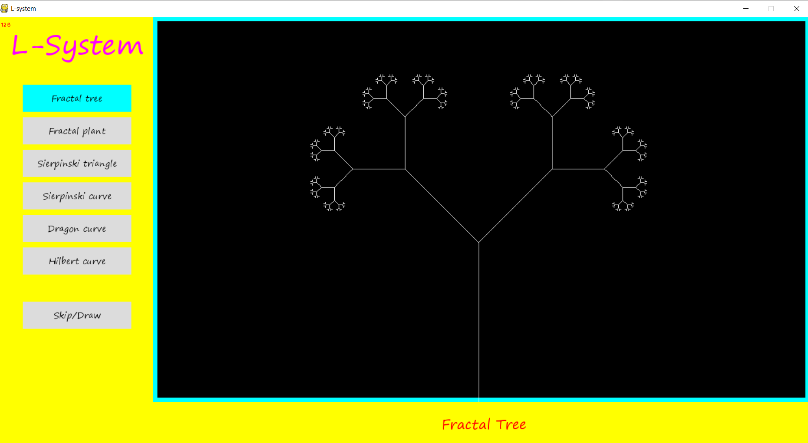
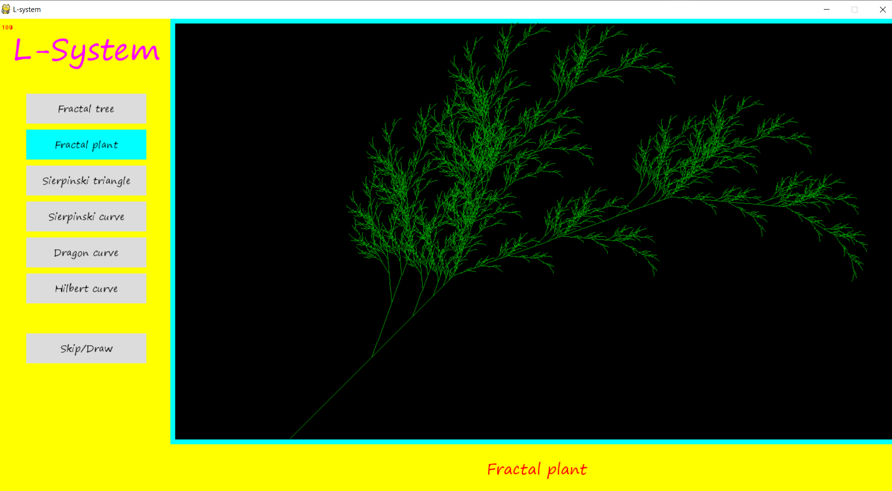
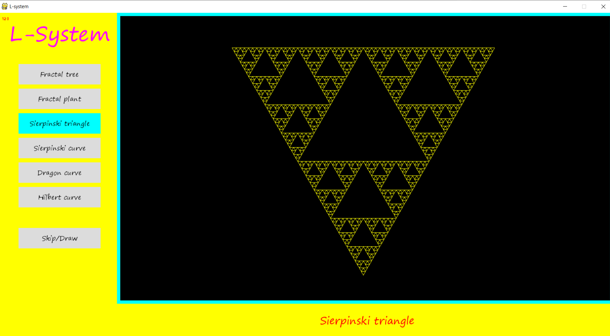
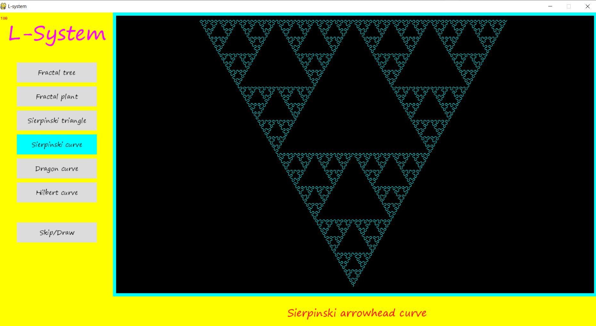
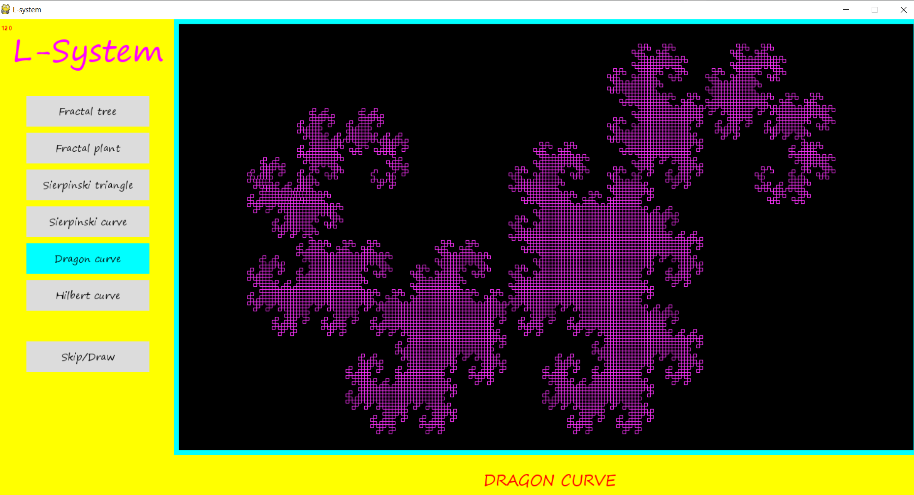
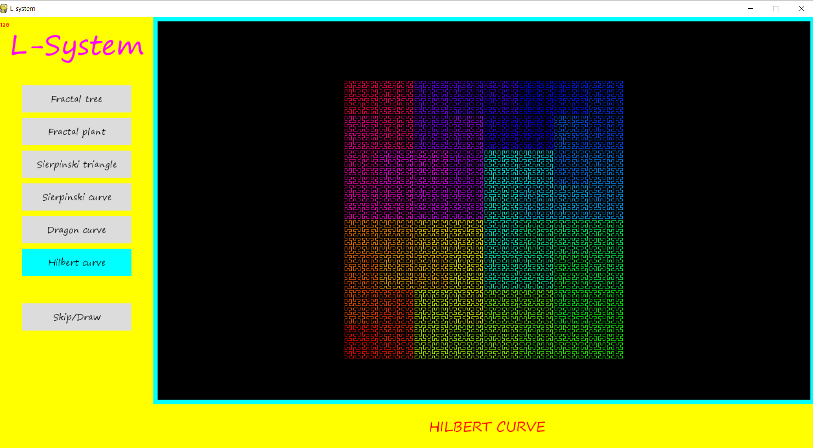

# L-system
An L-system or Lindenmayer system is a parallel rewriting system and a type of formal grammar. An L-system consists of an alphabet of symbols that can be used to make strings, a collection of production rules that expand each symbol into some larger string of symbols, an initial "axiom" string from which to begin construction, and a mechanism for translating the generated strings into geometric structures. L-systems were introduced and developed in 1968 by Aristid Lindenmayer, a Hungarian theoretical biologist and botanist at the University of Utrecht. Lindenmayer used L-systems to describe the behaviour of plant cells and to model the growth processes of plant development. L-systems have also been used to model the morphology of a variety of organisms[1] and can be used to generate self-similar fractals.

## L-system structure
L-systems are defined as a tuple
##### G = (V, ω, P),
where,
V is a set of symbols containing both elements that can be replaced (variables) and those which cannot be replaced ("constants").
ω (start, axiom or initiator) is a string of symbols from V defining the initial state of the system.
P is a set of production rules or productions defining the way variables can be replaced with combinations of constants and other variables. A production consists of two strings, the predecessor and the successor.

The rules of the L-system grammar are applied iteratively starting from the initial state. 

Using L-systems for generating graphical images requires that the symbols in the model refer to elements of a drawing on the computer screen. For example, the program Fractint uses turtle graphics (similar to those in the Logo programming language) to produce screen images. It interprets each constant in an L-system model as a turtle command.

### Example: Fractal (binary) tree
  variables : 0, 1  
  constants: [,]  
  axiom : 0   
  rules : (1 → 11), (0 → 1[0]0)

   The shape is built by recursively feeding the axiom through the production rules. Each character of the input string is checked         against the rule list to determine which character or string to replace it with in the output string. In this example, a '1' in the     input string becomes '11' in the output string, while '[' remains the same. Applying this to the axiom of '0', we get:

  axiom:	0 
  1st recursion:	1[0]0 
  2nd recursion:	11[1[0]0]1[0]0  
  3rd recursion:	1111[11[1[0]0]1[0]0]11[1[0]0]1[0]0  
  …

   We can see that this string quickly grows in size and complexity. This string can be drawn as an image by using turtle graphics,        where   each symbol is assigned a graphical operation for the turtle to perform. For example, in the sample above, the turtle may be    given the following instructions:

  0: draw a line segment ending in a leaf
  1: draw a line segment
  [: push position and angle, turn left 45 degrees
  ]: pop position and angle, turn right 45 degrees
  

## Installation
clone this repository and execute the following commands:
   ##### to install requirements:
          pip install -r requirements.txt 
   ##### to try the code:
          python L_system.py
  
## screen-shots

